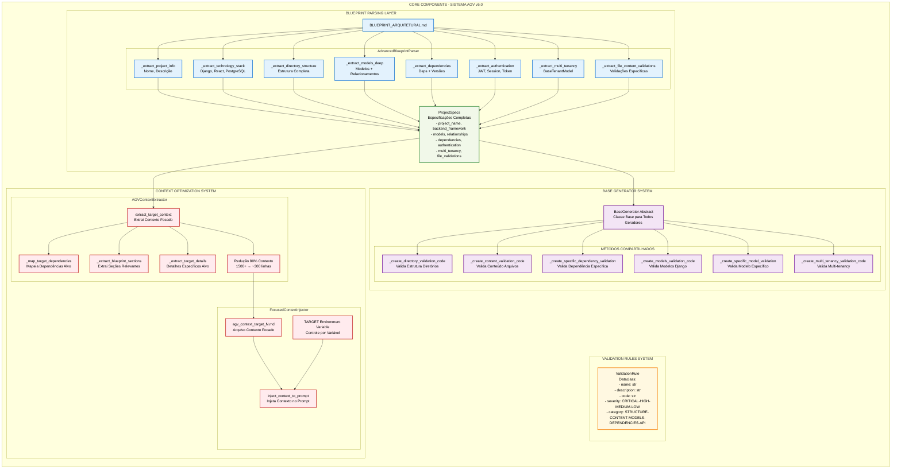

# Componentes Core - Sistema AGV v5.0

## Diagrama Detalhado dos Componentes Core



## Detalhamento dos Componentes

### **AdvancedBlueprintParser**
O parser inteligente que extrai especificações complexas do Blueprint:

#### **Métodos de Extração:**
- **`_extract_project_info()`** - Nome e descrição do projeto
- **`_extract_technology_stack()`** - Django, React, PostgreSQL com versões
- **`_extract_directory_structure()`** - Árvore completa de diretórios
- **`_extract_models_deep()`** - Modelos Django com campos e relacionamentos
- **`_extract_dependencies()`** - Dependências backend/frontend com versões
- **`_extract_authentication()`** - JWT, Session ou Token
- **`_extract_multi_tenancy()`** - Detecta BaseTenantModel
- **`_extract_file_content_validations()`** - Validações específicas por arquivo

### **ProjectSpecs (Dataclass)**
Especificações completas extraídas do Blueprint:

```python
@dataclass
class ProjectSpecs:
    project_name: str
    backend_framework: str          # django, flask, etc
    frontend_framework: str         # react, vue, etc
    database: str                   # postgresql, mysql, etc
    architecture_type: str          # monolith, microservices
    models: Dict[str, Dict]         # modelo -> {fields: [], meta: {}}
    dependencies: Dict[str, List]   # backend/frontend
    multi_tenancy: bool
    authentication_method: str      # JWT, Token, Session
    file_content_validations: Dict  # arquivo -> validações
    # ... mais 15+ campos especializados
```

### **ValidationRule System**
Sistema de regras de validação padronizadas:

```python
@dataclass  
class ValidationRule:
    name: str                      # validate_django_models
    description: str               # "Valida modelos Django"
    code: str                      # Código Python gerado
    severity: str                  # CRITICAL-HIGH-MEDIUM-LOW
    category: str                  # STRUCTURE-CONTENT-MODELS-DEPENDENCIES-API
```

### **BaseGenerator (Abstract)**
Classe base abstrata com métodos compartilhados:

#### **Métodos Utilitários:**
- **`_create_directory_validation_code()`** - Gera código para validar estrutura
- **`_create_content_validation_code()`** - Gera código para validar conteúdo
- **`_create_specific_dependency_validation()`** - Valida dependência específica
- **`_create_models_validation_code()`** - Valida modelos Django gerais
- **`_create_specific_model_validation()`** - Valida modelo específico
- **`_create_multi_tenancy_validation_code()`** - Valida multi-tenancy

### **Context Optimization System**

#### **AGVContextExtractor**
Extrator de contexto focado que reduz em 80% o tamanho:

- **Input**: Blueprint completo (1500+ linhas)
- **Output**: Contexto focado (~300 linhas)
- **Benefício**: Performance e precisão dos subagents

#### **FocusedContextInjector**
Injetor dinâmico de contexto:

- **Controle**: Variável ambiente `TARGET`
- **Arquivo**: `agv_context_target_N.md`
- **Integração**: Automática com subagents

## **Fluxo de Processamento Core**

1. **Blueprint** → **AdvancedBlueprintParser** → **ProjectSpecs**
2. **ProjectSpecs** → **BaseGenerator** → **ValidationRules**
3. **Contexto Otimizado** → **Subagents** → **Validação Dinâmica**

## **Métricas de Performance**

- **Parsing**: ~2s para Blueprint de 1500+ linhas
- **Redução Contexto**: 80% (1500→300 linhas)
- **Geração Validador**: ~5s para 200+ regras
- **Execução Validação**: ~10s para projeto completo