# Fluxo de Geradores - Sistema AGV v5.0

## Diagrama de Fluxo dos Geradores Especializados

```mermaid
graph TB
    subgraph SYSTEM["SISTEMA DE GERADORES - FACTORY PATTERN"]
        direction TB
        
        subgraph ENTRY["VALIDATOR GENERATOR (Ponto de Entrada)"]
            VG[ValidatorGenerator<br/>Dispatcher Mestre]
            
            subgraph TYPES["TIPOS DE VALIDAÇÃO"]
                T1[scaffold<br/>Alvo 0]
                T2[target<br/>Alvos 1-N]  
                T3[integration<br/>T1-T8]
                T4[evolution<br/>F7]
            end
        end
        
        subgraph SCAFFOLD["SCAFFOLD GENERATOR (Alvo 0)"]
            SG[ScaffoldGenerator<br/>Validação Completa]
            
            SG1[Structure Rules<br/>Diretórios]
            SG2[Config Rules<br/>pyproject.toml]
            SG3[Content Rules<br/>settings.py]
            SG4[Dependency Rules<br/>Django/DRF]
            SG5[Framework Rules<br/>Django + React]
            SG6[MultiTenancy Rules<br/>BaseTenantModel]
            SG7[Documentation Rules<br/>README/LICENSE]
            SG8[Docker Rules<br/>Dockerfile]
            SG9[Development Rules<br/>pre-commit]
        end
        
        subgraph TARGET["TARGET GENERATOR (Alvos 1-N)"]
            TG[TargetGenerator<br/>Validação Específica]
            
            subgraph INFERENCE["CONTEXT INFERENCE"]
                TG1[Context Specs<br/>Inferência]
                TG2[Views<br/>LoginView]
                TG3[URLs<br/>api/auth/]
                TG4[Files<br/>views.py]
                TG5[Components<br/>React]
                TG6[Settings<br/>JWT]
            end
            
            subgraph TARGETRULES["REGRAS TARGET"]
                TG7[Specific Rules<br/>Arquivos]
                TG8[Model Rules<br/>Modelos]
                TG9[API Rules<br/>Views]
                TG10[View Rules<br/>Templates]
                TG11[Test Rules<br/>Testes]
                TG12[Migration Rules<br/>Migrações]
                TG13[Config Rules<br/>Settings]
            end
        end
        
        subgraph INTEGRATION["INTEGRATION GENERATOR (T1-T8)"]
            IG[IntegrationGenerator<br/>Testes Integração]
            
            IG1[Flow Rules<br/>Entre Módulos]
            IG2[Coverage Rules<br/>Cobertura]
            IG3[API Rules<br/>Integração]
            IG4[Database Rules<br/>Integridade]
            IG5[Security Rules<br/>Segurança]
        end
        
        subgraph EVOLUTION["EVOLUTION GENERATOR (F7)"]
            EG[EvolutionGenerator<br/>Evolução]
            
            EG1[Quality Rules<br/>Qualidade]
            EG2[Refactor Rules<br/>Refatoração]
            EG3[Performance Rules<br/>Performance]
            EG4[Docs Rules<br/>Documentação]
            EG5[Security Rules<br/>Segurança]
        end
        
        subgraph OUTPUT["SAÍDA - VALIDADORES GERADOS"]
            OUT1[validate_scaffold_new.py<br/>200+ Validações]
            OUT2[validate_target_N.py<br/>80+ Validações]
            OUT3[validate_integration_T1.py<br/>40+ Validações]
            OUT4[validate_evolution.py<br/>60+ Validações]
        end
    end
    
    %% CONEXÕES PRINCIPAIS
    VG --> T1
    VG --> T2
    VG --> T3
    VG --> T4
    
    T1 --> SG
    T2 --> TG
    T3 --> IG
    T4 --> EG
    
    SG --> SG1
    SG --> SG2
    SG --> SG3
    SG --> SG4
    SG --> SG5
    SG --> SG6
    SG --> SG7
    SG --> SG8
    SG --> SG9
    
    TG --> TG1
    TG1 --> TG2
    TG1 --> TG3
    TG1 --> TG4
    TG1 --> TG5
    TG1 --> TG6
    
    TG --> TG7
    TG --> TG8
    TG --> TG9
    TG --> TG10
    TG --> TG11
    TG --> TG12
    TG --> TG13
    
    IG --> IG1
    IG --> IG2
    IG --> IG3
    IG --> IG4
    IG --> IG5
    
    EG --> EG1
    EG --> EG2
    EG --> EG3
    EG --> EG4
    EG --> EG5
    
    SG --> OUT1
    TG --> OUT2
    IG --> OUT3
    EG --> OUT4
    
    %% STYLING
    classDef master fill:#1A237E,stroke:#000051,stroke-width:3px,color:#FFF
    classDef scaffold fill:#2E7D32,stroke:#1B5E20,stroke-width:2px,color:#FFF
    classDef target fill:#E65100,stroke:#BF360C,stroke-width:2px,color:#FFF
    classDef integration fill:#4A148C,stroke:#311B92,stroke-width:2px,color:#FFF
    classDef evolution fill:#B71C1C,stroke:#7F0000,stroke-width:2px,color:#FFF
    classDef output fill:#006064,stroke:#004D40,stroke-width:2px,color:#FFF
    
    class VG,T1,T2,T3,T4 master
    class SG,SG1,SG2,SG3,SG4,SG5,SG6,SG7,SG8,SG9 scaffold
    class TG,TG1,TG2,TG3,TG4,TG5,TG6,TG7,TG8,TG9,TG10,TG11,TG12,TG13 target
    class IG,IG1,IG2,IG3,IG4,IG5 integration
    class EG,EG1,EG2,EG3,EG4,EG5 evolution
    class OUT1,OUT2,OUT3,OUT4 output
```



## Detalhamento dos Geradores

### **ValidatorGenerator (Dispatcher Mestre)**
Ponto de entrada único com sistema de dispatch inteligente:

```bash
# Exemplos de uso:
python validator_generator.py BLUEPRINT.md scaffold
python validator_generator.py BLUEPRINT.md target --target-number 3
python validator_generator.py BLUEPRINT.md integration --integration-phase T1
python validator_generator.py BLUEPRINT.md evolution
```

#### **Tipos de Validação Suportados:**
- **`scaffold`** → ScaffoldGenerator (Alvo 0)
- **`target`** → TargetGenerator (Alvos 1-N)
- **`integration`** → IntegrationGenerator (T1-T8)
- **`evolution`** → EvolutionGenerator (F7)

---

### **ScaffoldGenerator (Alvo 0)**
Gerador especializado para validação de estrutura completa do projeto:

#### **Regras Geradas (9 categorias):**
1. **Structure Rules** - Estrutura de diretórios conforme Blueprint
2. **Configuration Rules** - pyproject.toml, docker-compose.yml, .env
3. **Content Rules** - settings.py, models.py, conteúdo específico
4. **Dependency Rules** - Django, DRF, PostgreSQL com versões
5. **Framework Rules** - Django Settings avançados, React Package.json
6. **Multi-tenancy Rules** - BaseTenantModel, isolamento de dados
7. **Documentation Rules** - README.md, LICENSE, CHANGELOG.md
8. **Docker Rules** - Dockerfile, .dockerignore, containerização
9. **Development Rules** - .pre-commit, .gitignore, ferramentas qualidade

#### **Output:** `validate_scaffold_new.py` (~129KB, 200+ validações)

---

### **TargetGenerator (Alvos 1-N)**
Gerador especializado para validação de alvos específicos:

#### **Context Inference (Inferência Inteligente):**
Sistema que distribui automaticamente funcionalidades por alvo:

```python
# Exemplo para Alvo 3 (sistema bancário):
{
    'models': ['Loan', 'Transaction'],           # Modelos específicos
    'views': ['LoanListView', 'LoanDetailView'], # Views inferidas
    'urls': ['api/loans/', 'api/transactions/'], # URLs do domínio  
    'components': ['LoanForm', 'Dashboard'],     # Componentes React
    'settings': ['JWT_SECRET_KEY', 'DATABASES']  # Settings relevantes
}
```

#### **Regras Geradas (7 categorias):**
1. **Target-Specific Rules** - Arquivos específicos do alvo
2. **Model Rules** - Modelos + relacionamentos do alvo
3. **API Rules** - Views, URLs, serializers do alvo
4. **View Rules** - Templates Django / Componentes React
5. **Test Rules** - Testes unitários obrigatórios
6. **Migration Rules** - Migrações Django do alvo
7. **Config Rules** - Settings específicos do alvo

#### **Output:** `validate_target_N.py` (~50KB, 80+ validações)

---

### **IntegrationGenerator (T1-T8)**
Gerador para validação de testes de integração entre módulos:

#### **Fases de Integração:**
- **T1** - Auth + Core Integration
- **T2** - Finance + Operations Integration  
- **T3** - Frontend + Backend Integration
- **T4-T8** - Integrações específicas do domínio

#### **Regras Geradas (5 categorias):**
1. **Integration Flow Rules** - Fluxos entre módulos
2. **Test Coverage Rules** - Cobertura de testes integração
3. **API Integration Rules** - Integração entre APIs
4. **Database Integrity Rules** - Integridade referencial
5. **Security Rules** - Validações de segurança

#### **Output:** `validate_integration_T1.py` (~30KB, 40+ validações)

---

### **EvolutionGenerator (F7)**
Gerador para validação de evolução e manutenção:

#### **Regras Geradas (5 categorias):**
1. **Code Quality Rules** - Qualidade de código, métricas
2. **Refactoring Rules** - Validações de refatoração
3. **Performance Rules** - Performance e otimizações
4. **Documentation Evolution Rules** - Docs atualizadas
5. **Security Evolution Rules** - Segurança evolutiva

#### **Output:** `validate_evolution.py` (~40KB, 60+ validações)

---

## **Factory Pattern Implementation**

### **Vantagens da Arquitetura:**
1. **Single Point of Entry** - ValidatorGenerator como dispatcher
2. **Specialized Factories** - Cada gerador focado em sua responsabilidade
3. **Extensibilidade** - Fácil adição de novos tipos de validação
4. **Reutilização** - BaseGenerator compartilha código comum
5. **Context-Aware** - Cada gerador adapta-se ao contexto específico

### **Métricas de Performance:**
- **Scaffold**: ~200 regras em ~5s
- **Target**: ~80 regras em ~2s  
- **Integration**: ~40 regras em ~1s
- **Evolution**: ~60 regras em ~2s

### **Sistema de Scoring:**
```python
SEVERITY_WEIGHTS = {
    "CRITICAL": 15,  # Problemas que quebram o sistema
    "HIGH": 8,       # Problemas que impactam funcionalidade
    "MEDIUM": 2,     # Problemas que afetam qualidade
    "LOW": 1         # Melhorias e sugestões
}

CATEGORY_WEIGHTS = {
    "STRUCTURE": 1.0,     # Estrutura de arquivos
    "CONTENT": 1.5,       # Conteúdo de arquivos
    "MODELS": 2.0,        # Modelos e BD (mais crítico)
    "DEPENDENCIES": 1.2,  # Dependências
    "API": 1.3           # APIs e endpoints
}
```